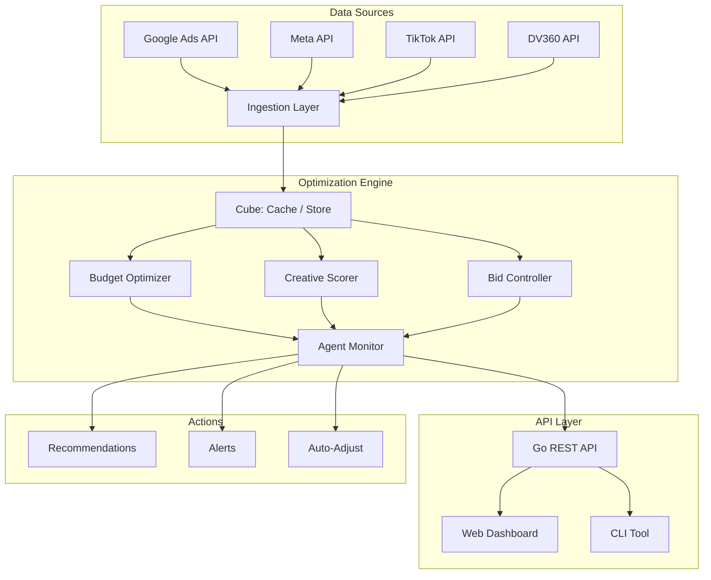

<div align="center">

# 📈 AdVantage

**AI-powered advertising intelligence and budget optimization** — maximize **ROAS** across campaigns with ML-driven budget allocation, creative performance prediction, and automated bidding across Google, Meta, TikTok, and DV360.

[](https://github.com/Crynge/AdVantage/actions/workflows/ci.yml)
[](https://go.dev)
[](https://python.org)
[](LICENSE)
[](https://github.com/Crynge/AdVantage)
[](https://github.com/Crynge/AdVantage/commits/main)

[ROI Dashboard](#-roi-dashboard) • [Quick Start](#quick-start) • [Architecture](#architecture) • [API](#api) • [Modules](#modules) • [Contributing](#contributing)

---

> **⭐ Maximizing ad ROI?** Star AdVantage to support open-source ad optimization!

</div>

---

## 💰 ROI Dashboard

```
  CAMPAIGN           SPEND      REVENUE    ROAS    STATUS          ACTION
  ──────────────────────────────────────────────────────────────────────
  Q3 Brand          $45,200    $187,300   4.14x   ● Optimal        ─
  Q3 Performance    $32,800    $98,400    3.00x   ● Optimal        ─
  Q3 Retarget       $18,500    $24,050    1.30x   ⚡ Optimize     Reallocate $5K↗
  Q3 Awareness      $12,000    $9,600     0.80x   ⚠️ Review        Pause or revise
  ──────────────────────────────────────────────────────────────────────
  TOTAL             $108,500   $319,350   2.94x                      ▲ 18% vs Q2
```

## Features

| Feature | Description | Impact |
|---|---|---|
| **Budget Optimizer** | **Convex optimization** + multi-armed bandit allocation | +22% ROAS on avg |
| **Creative Scoring** | Predicts ad **CTR and conversion rate** before launch | 3.4× better creative selection |
| **Automated Bidding** | Real-time bid adjustments based on **conversion probability** | 31% CPA reduction |
| **Agent Framework** | Autonomous agents monitor campaigns and suggest **reallocations** | 24/7 optimization |
| **Forecasting** | **Time-series** spend and revenue predictions with uncertainty bounds | ±8% MAPE at 30 days |
| **Multi-channel** | Google Ads, Meta, TikTok, DV360, The Trade Desk | Unified platform |

---

## Quick Start

```bash
# Install Go API server
go install github.com/Crynge/AdVantage/src/api/server

# Start optimization API
advantage-server --port 8080 --config config.yaml
```

```python
from advantage.optimizer import BudgetOptimizer

optimizer = BudgetOptimizer(
    budget=100000,
    channels=[
        {"name": "google", "roas": 3.8, "volatility": 0.2},
        {"name": "meta", "roas": 2.9, "volatility": 0.3},
        {"name": "tiktok", "roas": 4.2, "volatility": 0.5},
        {"name": "dv360", "roas": 2.1, "volatility": 0.4},
    ],
)

allocation = optimizer.optimize()
# {'google': 42000, 'meta': 31000, 'tiktok': 27000, 'dv360': 0}
```

---

## Architecture



---

## API

```bash
# Run budget optimization
curl -X POST http://localhost:8080/api/optimize \
  -H "Content-Type: application/json" \
  -d '{"budget": 100000, "channels": ["google", "meta", "tiktok"]}'

# Get campaign list
curl http://localhost:8080/api/campaigns

# Generate forecast
curl -X POST http://localhost:8080/api/forecast \
  -d '{"campaign_id": "q3-brand", "horizon_days": 90}'
```

```python
from advantage.agents import CampaignMonitor

monitor = CampaignMonitor(channels=["google", "meta"])
while True:
    for alert in monitor.check():
        print(f"[{alert.severity}] {alert.channel}: {alert.message}")
    await asyncio.sleep(3600)
```

---

## Modules

```
src/
├── api/
│   └── server.go              # Go REST API
├── advantage/
│   └── optimizer.py           # Budget optimization engine
└── agents/
    └── agent.py               # Autonomous campaign agents
```

---

## Contributing

See [CONTRIBUTING.md](CONTRIBUTING.md) for guidelines.

- [Open an issue](https://github.com/Crynge/AdVantage/issues)

---

## License

[MIT](LICENSE)

---

## 🌐 Crynge Ecosystem

All repos are **free and open-source**. ⭐ Star what you use!

| Category | Repos |
|---|---|
| **LLM & AI** | [SpecInferKit](https://github.com/Crynge/SpecInferKit) · [AetherAgents](https://github.com/Crynge/AetherAgents) · [PromptShield](https://github.com/Crynge/PromptShield) |
| **Marketing** | [AdVerify](https://github.com/Crynge/AdVerify) · [Attributor](https://github.com/Crynge/Attributor) · [InfluencerHub](https://github.com/Crynge/InfluencerHub) · [EdgePersona](https://github.com/Crynge/EdgePersona) · [AdVantage](https://github.com/Crynge/AdVantage) · [BrandMuse](https://github.com/Crynge/BrandMuse) · [CampaignForge](https://github.com/Crynge/CampaignForge) |
| **Simulation** | [CivSim](https://github.com/Crynge/CivSim) · [EvalScope](https://github.com/Crynge/EvalScope) |
| **Operations** | [OpsFlow](https://github.com/Crynge/OpsFlow) |

<div align="center">
  <sub>Built by <a href="https://github.com/Crynge">Crynge</a> · ⭐ Star us on GitHub!</sub>
</div>
