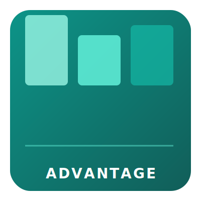

<div align="center">
  
  <p><strong>AI-Powered Advertising Intelligence & Budget Optimization</strong></p>
  <p>Multi-agent ad creative testing · budget allocation · audience insights · performance tracking</p>

  [](https://python.org)
  [](https://go.dev/)
  [](LICENSE)
  [](https://github.com/Crynge/AdVantage/actions/workflows/ci.yml)
  [](https://github.com/astral-sh/ruff)
  [](https://github.com/Crynge/AdVantage)

</div>

---

## Overview

AdVantage deploys specialized AI agents to optimize every layer of digital advertising. From creative analysis and audience research to budget allocation and performance tracking, it works like an autonomous ad buying desk — but runs on your infrastructure.

## Key Features

- **Creative performance scoring** — Predicts ad creative effectiveness before launch
- **Budget optimization** — Dynamic allocation across channels and campaigns
- **Audience intelligence** — Lookalike discovery, segmentation, and targeting suggestions
- **Performance analytics** — Real-time attribution with causal impact models
- **Platform-agnostic** — Works with Meta Ads, Google Ads, LinkedIn, TikTok, and more

## Architecture

```
Campaign Config → BudgetOptimizer → CreativeAnalyst
                  → AudienceResearcher → PerformanceTracker
                    → Unified Budget & Creative Recommendations
```

## Quick Start

```bash
pip install -e .
python -m advantage optimize --budget 50000 --platforms meta,google,linkedin
```

## Installation

```bash
git clone https://github.com/Crynge/AdVantage.git
cd AdVantage
pip install -e ".[dev]"
```

## Usage

```python
from advantage import AdOptimizer

optimizer = AdOptimizer(
    platforms=["meta", "google", "linkedin"],
    total_budget=100000,
    currency="USD"
)

plan = optimizer.optimize(
    campaign_name="Summer Sale 2026",
    target_cpa=25.00,
    creative_assets=["./assets/creative_v1.jpg", "./assets/creative_v2.mp4"],
    audience_segments=["retargeting", "lookalike", "prospecting"]
)

print(plan.budget_allocation)
print(plan.predicted_roi)
```

## Agent Roles

| Agent | Role | Tools |
|-------|------|-------|
| CreativeAnalyst | Scores ad creatives, suggests variations, predicts CTR | Vision AI, copy scoring |
| BudgetOptimizer | Allocates budget across channels, optimizes bids | Portfolio optimizer, bid simulator |
| AudienceResearcher | Finds high-value segments, lookalike modeling | Demographic API, interest graph |
| PerformanceTracker | Real-time attribution, anomaly detection | Analytics pipeline, alert engine |
